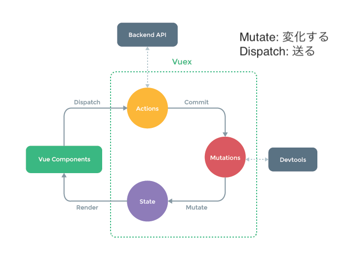

# Vue.jsで0からプロジェクトを作ってみた


https://github.com/akihito-okada/vuejssample

---

# 背景
    - Vue.jsを0からまともに触ったことなかった
    - tcm-webのプルリクをみてもよくわからない
    - 試しに触ってみる

---

# Vue.js

- Vue.jsとは、JavaScriptのフレームワークの1種

### メリット

- 気軽に使える
- DOM操作を自動的に行ってくれる
- 他のフレームワークより学習コストが低い

https://techacademy.jp/magazine/21456

---

# インストール

Vue.js公式のインストールガイド
https://v3.ja.vuejs.org/guide/installation.html

```
# 最新安定版のVueをインストール
$ npm install vue@next

# VueのCLIののインストール
npm install - @vue/cli

```

---

# アプリを作る

```
# Generate Vue.js app
$ npm init vite@latest vuejssample -- --template vue

# Launch new app
$ cd vuejssample
$ npm install
$ npm run dev

 vite v2.7.12 dev server running at:

  > Local: http://localhost:3000/
  > Network: use `--host` to expose

  ready in 473ms.

```

---

# アプリを作る - デモ

---

# 画面遷移


- Vue Routerとは
Vue.jsを利用したSPA構築で、ルーティング制御をするための公式プラグイン

https://qiita.com/hshota28/items/765cf903f055754f7557

---


# 画面遷移 - セットアップ

```
$ npm install vue-router@next
```

---

# 画面遷移 - デモ

---

# Vuex

- Vue.js アプリケーションのための 状態管理パターン + ライブラリ



---

# Vuex - セットアップ

https://vuex.vuejs.org/ja/installation.html

```
npm install vuex@next --save
```
---

# Vuex - デモ

---


# API通信
axiosを使って実装するのが一般的
### axiosの特徴
- 豊富なオプションがあり、簡単に記述できる
- Promise(非同期処理のライブラリ)ベース

https://www.yoheim.net/blog.php?q=20170801

---

# API通信 - セットアップ


https://qiita.com/ksh-fthr/items/2daaaf3a15c4c11956e9

https://www.webprofessional.jp/mock-rest-apis-using-json-server/

```
# axiosのインストール
$ npm install axios --save

# json-serverのインストール
$ npm install -g json-server
$ json-server --watch currentprice.json
```

---

# API通信 - Repositoryパターン


https://github.com/the-chain-museum/tcm-web

- Repositoryの初期化
- Modelへのパース

---

# API通信 - デモ

---

# TypeScript + Vue.js

- TypeScriptへの置き換えは断念
- 結構書き方が変わるので大変

---

# TypeScriptのデバッグ環境

シンプルに実行できる環境をつくる
VS Codeで ts-nodeを使って TypeScriptをデバッグする方法
https://www.walbrix.co.jp/article/debug-typescript-with-ts-node.html

```
# ts-nodeのインストール
$ npm install ts-node --save-dev
```

---

# TypeScriptのデバッグ環境 - デモ 

---

# まとめ

- tcm-webが以前よりは読めるようになってきた
- Vuexまわり、JSのわかりにくさが邪魔をしている
- Vue.jsレベル5くらいになった
- TypeScript、css、複雑なViewの構築などやってみたい
- Server Side Kotlin/AWSでRest APIをつくってみるとかしたい
